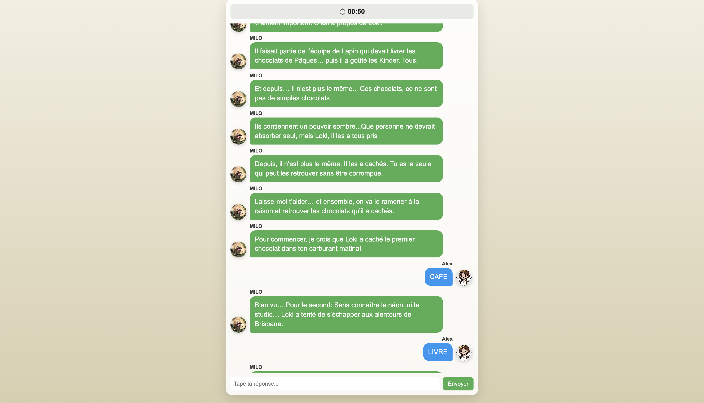

# Loki Escape Game API

Backend FastAPI pour un escape game interactif sous forme de faux chat. Le joueur progresse dans le scénario en résolvant des énigmes et en envoyant des mots-clés qui débloquent les différentes étapes du jeu.

## Aperçu

<p align="center">
  
</p>

## Fonctionnement

Le joueur démarre une partie et reçoit une conversation simulée avec un personnage.

Chaque énigme correspond à une phase du scénario :

- le joueur envoie une réponse ;
- l'API valide le mot-clé ;
- la progression est mise à jour ;
- de nouveaux messages sont débloqués.

La logique du scénario est séparée du code applicatif afin de pouvoir modifier l'histoire sans modifier l'API.

## Installation

```bash
python3 -m venv venv
source venv/bin/activate

```

## Lancer le serveur

```bash
uvicorn app.main:app --reload

```

## Swagger

Une fois le serveur démarré :

Swagger UI : http://127.0.0.1:8000/docs
ReDoc : http://127.0.0.1:8000/redoc

## Endpoints

### Démarrer une partie

POST /game/start

### Voir l’état du joueur

GET /game/state/{player_id}

### Voir les messages du chat

GET /game/messages/{player_id}

### Soumettre un mot-clé

POST /game/submit

Exemple de payload :

{
"player_id": "uuid-du-joueur",
"answer": " cafe "
}

---

## Rôle de chaque fichier

### `app/main.py`

Point d’entrée de l’application FastAPI. Il crée l’app et enregistre les routes.

### `app/routes/game.py`

Couche HTTP. Elle expose les endpoints REST et transforme les erreurs métier simples en réponses HTTP adaptées.

### `app/services/game_service.py`

Cœur de la logique métier. C’est ici qu’on démarre une partie, qu’on valide les réponses, qu’on débloque les phases et qu’on retourne les messages dans le bon ordre.

### `app/core/scenario.py`

Contient les données du scénario : messages d’introduction, mots-clés par phase, transitions, et déblocage final. C’est le fichier à modifier pour enrichir le contenu du jeu.

### `app/core/store.py`

Stockage mémoire de la V1. Il isole la persistance pour pouvoir la remplacer plus tard sans casser les routes ni la logique métier.

### `app/schemas/game.py`

Schémas Pydantic pour valider les entrées et structurer toutes les réponses JSON.

---

---

## Choix d’architecture

- **Routes séparées de la logique métier** : les endpoints restent très légers.
- **Scénario séparé des traitements** : tu peux enrichir l’histoire sans toucher à la logique FastAPI.
- **Store isolé** : aujourd’hui en mémoire, demain remplaçable par une vraie base.
- **Schémas Pydantic** : pratique pour Swagger, la validation et la clarté des contrats API.
- **Normalisation des réponses** : les mots-clés sont validés sans tenir compte de la casse ni des espaces parasites.
- **Structure évolutive** : tu peux ajouter facilement un score, un timer, des indices, des essais limités, ou des sessions réelles.

---

## Notes utiles

- Cette V1 fonctionne sans base de données.
- Le stockage est perdu si le serveur redémarre.
- Chaque `player_id` représente une partie.
- L’ordre des énigmes est respecté par phase, mais la validation dans une même phase peut se faire tant que le mot appartient à la phase courante. Si tu veux forcer un ordre strict mot par mot, on pourra l’ajouter dans une V2.
